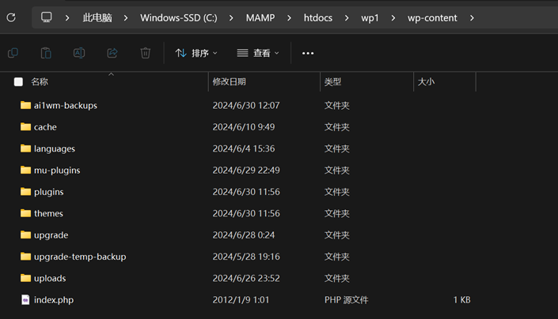

# 31joint-WordPress
## 项目代码


## 项目内容
```bash
\---项目内容wp-content（提交的代码文件夹，即wp-content.zip压缩包）
	+-- 网站主题文件夹themes
	|	+---项目主体文件夹medicine（编写的主要代码储存）
	|	+---编写的php文件储存：medicine，medicine/includes,medicine/template-parts
	|	+---javascript文件夹：src/modules
	|	\---css文件夹：css/modules
	+---上传文件文件夹uploads/年/月
	+---插件文件夹plugins（需要文件夹中的所有插件来实现网站功能）
	\---强制插件文件夹mu-plugins（运行网站的必要插件）

```

